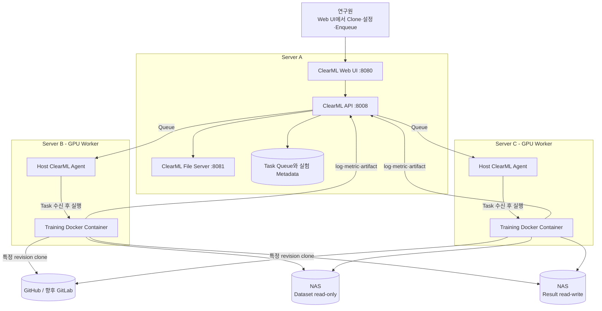

# 시스템 구조

## 목표와 배치

한 대의 ClearML Server와 여러 GPU Worker를 사용해 Task 상태와 실험 기록은 중앙화하고 계산 자원은 수평으로 확장한다. Server A는 관리 plane, Server B/C는 실행 plane이다.

## 구성 요소 관계

ClearML Server는 Web UI, REST API, File Server와 Task/Queue 상태를 제공한다. Server A에만 두면 연구원이 한 곳에서 모든 실험을 조회·비교할 수 있고 B/C의 장애가 관리 이력을 나누지 않는다. Server A에서 실제 학습을 실행할 필요는 없지만 나중에 별도 Queue의 Agent를 추가할 수 있다.

ClearML Agent는 B/C 호스트에 설치된다. Agent가 GPU, Docker daemon, NAS mount를 직접 확인한 후 Queue의 Task를 가져온다. Agent가 띄운 Training Container 안에는 CUDA/Python/PyTorch/모델 framework가 있고, Task가 기록한 Git revision의 코드가 실행된다.

Docker Image와 Git 코드를 분리한다. Image 변경은 느리고 검증이 필요한 system/runtime dependency를 관리하며, Git은 빠르게 바뀌는 학습 코드와 configuration을 관리한다. Image에 전체 Repository를 복사하지 않아 Task와 commit의 연결을 명확히 한다.

NAS의 dataset은 원칙적으로 read-only, 결과 root는 해당 Worker/프로젝트에 필요한 범위만 write 가능하게 mount한다. 같은 설정이 모든 Worker에서 재현되도록 호스트와 container 모두 동일한 절대 경로를 사용한다.

## Task 실행 순서

1. 연구원이 Base Task를 Clone해 configuration, Git revision, Training Image와 Queue를 검토한다.
2. Enqueue된 Task를 B 또는 C의 Agent가 가져간다.
3. Agent가 지정 GPU를 할당하고 Training Container를 시작한다.
4. Agent가 Git code를 준비하고 dependency 환경을 재현한다.
5. Job이 configuration과 NAS 경로를 검증하고 학습을 실행한다.
6. console과 metric은 ClearML API로, dataset 및 큰 checkpoint/result는 NAS로 보낸다.
7. 작은 artifact 또는 NAS 결과를 설명하는 metadata를 Task에 등록한다.

현재 1~6의 기반은 Smoke Test로 확인할 수 있다. ESPnet/Embedding/LLM의 실제 trainer, checkpoint와 model registry 연결은 **향후 구현**이다.

