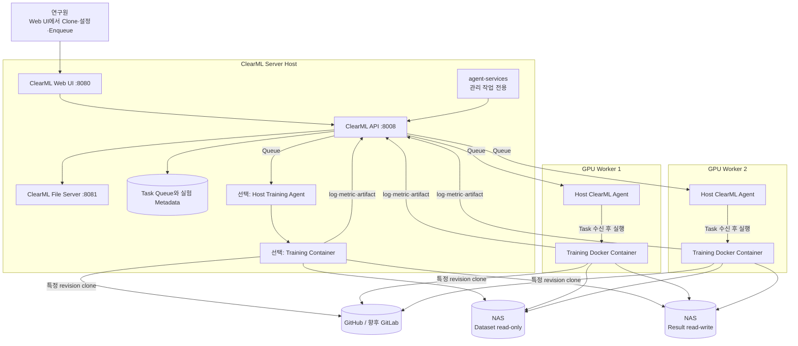

# 시스템 구조

## 목표와 배치

한 대의 ClearML Server와 여러 GPU Worker를 사용해 Task 상태와 실험 기록은 중앙화하고 계산 자원은 수평으로 확장한다. Server 호스트도 GPU Worker 조건을 충족하면 별도의 학습 Agent를 함께 실행할 수 있다.



## 구성 요소 관계

ClearML Server는 Web UI, REST API, File Server와 Task/Queue 상태를 제공한다. Server는 한 호스트에만 두어 관리 이력을 중앙화한다. Server 호스트에서 학습도 실행하려면 Compose의 `agent-services`와 별개로 일반 ClearML Agent를 설치한다.

ClearML Agent는 각 GPU Worker 호스트에 설치된다. Agent가 GPU, Docker daemon, 공유 storage mount를 확인한 후 Queue의 Task를 가져온다. Agent가 띄운 Training Container 안에는 CUDA/Python/PyTorch/모델 framework가 있고, Task가 기록한 Git revision의 코드가 실행된다.

Docker Image와 Git 코드를 분리한다. Image 변경은 느리고 검증이 필요한 system/runtime dependency를 관리하며, Git은 빠르게 바뀌는 학습 코드와 configuration을 관리한다. Image에 전체 Repository를 복사하지 않아 Task와 commit의 연결을 명확히 한다.

NAS의 dataset은 원칙적으로 read-only, 결과 root는 해당 Worker/프로젝트에 필요한 범위만 write 가능하게 mount한다. 같은 설정이 모든 Worker에서 재현되도록 호스트와 container 모두 동일한 절대 경로를 사용한다.

## Task 실행 순서

1. 연구원이 Base Task를 Clone해 configuration, Git revision, Training Image와 Queue를 검토한다.
2. Enqueue된 Task를 해당 Queue를 수신하는 Agent가 가져간다.
3. Agent가 지정 GPU를 할당하고 Training Container를 시작한다.
4. Agent가 Git code를 준비하고 dependency 환경을 재현한다.
5. Job이 configuration과 NAS 경로를 검증하고 학습을 실행한다.
6. console과 metric은 ClearML API로, dataset 및 큰 checkpoint/result는 NAS로 보낸다.
7. 작은 artifact 또는 NAS 결과를 설명하는 metadata를 Task에 등록한다.

현재 1~6의 기반은 Smoke Test로 확인할 수 있다. ESPnet/Embedding/LLM의 실제 trainer, checkpoint와 model registry 연결은 **향후 구현**이다.


## Job과 Backend 분리 원칙

플랫폼은 `jobs`와 `backends`를 두 축으로 관리한다. `jobs`는 STT Foundation, LLM Fine-tuning처럼 **무엇을 수행하는가**를 정의하고, `backends`는 ESPnet, ms-swift처럼 **어떤 Framework로 실행하는가**를 담당한다.

잘못된 조합을 막기 위해 복잡한 Plugin 시스템 대신 `configs/platform/capabilities.yaml` 하나를 정책 파일로 사용한다. 실행 직전에 `job.type`과 `backend.name` 조합을 한 번 검증하고, 통과한 경우에만 해당 Backend Runner를 로드한다.

```text
Job Config
  ├─ job.type = language.llm.finetune
  └─ backend.name = ms_swift
          │
          ▼
capabilities.yaml 검증
          │
          ▼
backends/ms_swift/runner.py
```

Metric은 가능한 경우 Framework-native TensorBoard 출력을 사용하고 ClearML을 최종 실험 관리 화면으로 둔다. 별도 TensorBoard parser는 실제 자동 capture 문제가 확인된 경우에만 추가한다.
